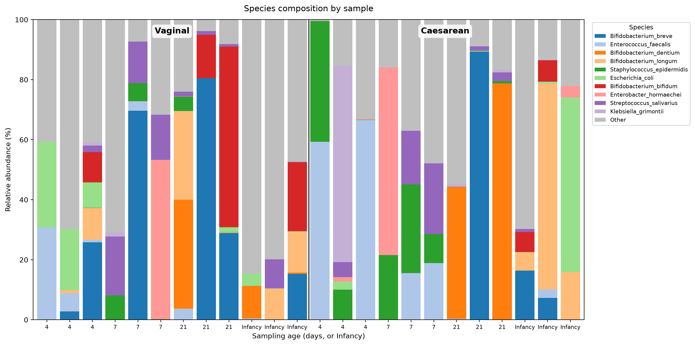
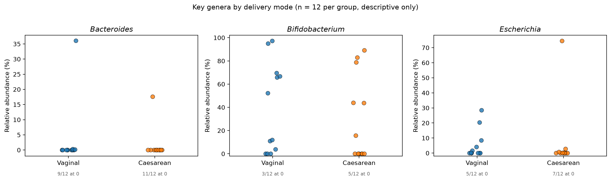

# infant-gut-shotgun

Reproducible shotgun metagenomics analysis of the Baby Biome Study infant gut
cohort, from raw reads on public archives through species-level composition,
built as a containerised Nextflow workflow on a SLURM cluster.

## What this does

Twenty-four infant gut metagenomes are retrieved from ENA, profiled
taxonomically with nf-core/taxprofiler running MetaPhlAn 4, and reduced to a
species-level abundance matrix joined to clinical metadata. Every input file,
version and design decision is pinned or documented, so the analysis can be
rebuilt from the repository alone.

Sample selection, host-read handling, database versions and the choice of
analysis entry point were each decided from measurements on this dataset
rather than from convention. Those measurements and their consequences are
written up in `docs/`.

## Figures

Per-sample species composition, top ten species by mean abundance with the
remainder pooled, grouped by delivery mode and ordered by sampling age:

Three genera reported in the birth-mode literature, shown per sample with the
number of samples at zero labelled under each group:

These are descriptive. With three samples per delivery-mode by sampling-age
cell, the design does not support a differential-abundance test.

## Data

Shao et al. 2019, *Nature* (Baby Biome Study). ENA project `ERP115334`,
which holds 1,679 metagenomic runs alongside 708 isolate genomes; the
isolates are excluded by filtering on `library_source`.

Clinical variables are not present in the ENA metadata. They come from the
paper's Supplementary Table 1 and are joined to the run report on
`secondary_sample_accession` under a one-to-one validation that matches all
1,679 records.

Twenty-four samples were selected as a fully crossed 2 x 4 design, two
delivery modes by four sampling ages, three infants per cell, each infant
appearing once. Infants exposed to antibiotics in hospital are excluded by
restriction rather than matched, because exposure prevalence is 5-11% per
cell and matching would oversample it several-fold while perturbing the
community in the same direction as the contrast under study. The selection is
seeded, so the same command reproduces the same twenty-four samples.

## Pipeline

| Component | Version | Note |
|---|---|---|
| nf-core/taxprofiler | 2.0.1 (`70ecc15e49`) | pinned by tag |
| MetaPhlAn | 4 | index `mpa_vJun23_CHOCOPhlAnSGB_202403`, pinned |
| Nextflow | 26.04.6 | |
| Container runtime | Apptainer 1.5.3 | every process containerised |
| Scheduler | SLURM | `config/amarel.config` |

Read QC (fastp) and profile standardisation are enabled; host removal is
disabled. That decision rests on read-retention figures across all 1,679
runs, which are flat across sampling ages and identical in adult maternal
samples, indicating the host fraction is too small to justify the index
build. The reasoning is in `docs/04`.

Cluster resource limits in `config/amarel.config` each carry a comment naming
the command that measured them. The config describes the machine only;
analysis parameters live in the SLURM submission scripts, so the config is
reusable by other pipelines unchanged.

A smoke test (`workflow/run_taxprofiler_test.slurm`) runs the pipeline's own
test profile before any real data, separating configuration failures from
data problems and verifying the one assumption nothing else checks: that the
Nextflow head process, itself running on a compute node, can submit further
SLURM jobs.

## Repository layout

    config/     cluster configuration
    docs/       numbered notes: procedure and the evidence behind each decision
    src/        Python: metadata, sample selection, download, tables, figures
    workflow/   SLURM submission scripts
    notebooks/  reserved for exploratory analysis
    data/       generated tables and a symlink to reads (not in git)
    results/    pipeline and analysis output (not in git)

## Reproduce

    conda env create -f environment.yml
    conda activate nfcore
    mkdir -p logs

    python src/build_metadata.py
    python src/select_samples.py --input data/metadata_joined.tsv \
        --output data/selected_samples.tsv
    sbatch workflow/download.slurm
    python src/build_samplesheet.py

    sbatch workflow/download_metaphlan_db.slurm
    # write data/databases.csv pointing at the built index (see docs/05)

    sbatch workflow/run_taxprofiler_test.slurm    # smoke test first
    sbatch workflow/run_taxprofiler.slurm

    python src/build_species_table.py
    python src/plot_composition.py

`logs/` is git-ignored but SLURM will not create it, and a job whose output
directory is missing fails without writing a log explaining why.

Every script takes `--help`, prints a checkable count at each stage, and
exits non-zero when a count disagrees with what the stage should produce.

## Documentation

| | |
|---|---|
| `docs/01` | environment and container runtime |
| `docs/02` | joining ENA metadata to the paper's supplementary table |
| `docs/03` | sample selection: crossing, restriction, and the collision assertion |
| `docs/04` | read retrieval and the host-removal decision |
| `docs/05` | MetaPhlAn database build and container diagnosis |
| `docs/06` | taxonomic profiling run and configuration |
| `docs/07` | species table, and why the taxpasta merged table is not the entry point |

Each ends with a "Not yet done" section, so a reader can see where the
procedure stops rather than inferring it.

## Scope and limitations

Taxonomic profiling only. Functional profiling with HUMAnN3 was scoped and
deferred; assembly and strain-level analysis were cut early, as neither
carries much beyond microbial ecology and both cost more than the pipeline
engineering they would demonstrate.

Twenty-four samples, three per cell. This supports description and
composition summaries, not differential-abundance testing. No prevalence or
abundance filtering is applied, and eukaryotic and unnamed clades are
retained in the species matrix; the reasons and their consequences are in
`docs/07`.

The published cohort analysis is Shao et al. 2019. This repository is an
independent reprocessing of the public data, not a replication attempt, and
makes no claim about the cohort's biological findings.
